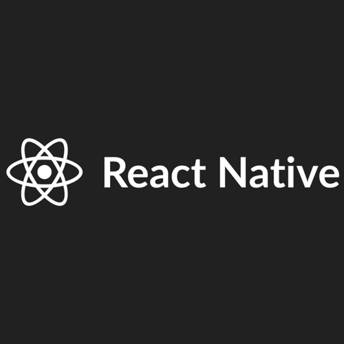
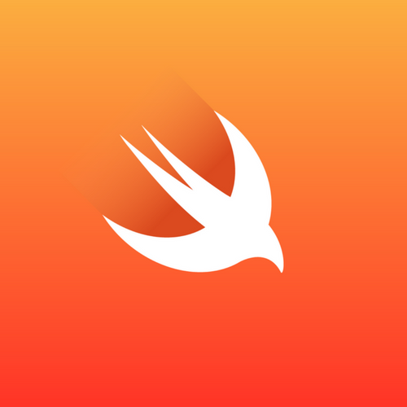

## Only available in iOS

# TuneSend
A fun IOS keyboard extension that inspires musical creativity 

## How It Works

Switch to TuneSend 

Type your Message 

Press the Play Button 

Paste the Recording 

Press Send  

## Running project locally
install node.js (if you do not have it installed. http://expressjs.com/en/starter/installing.html) 
npm install -g react-native-cli (if you do not have the react native cli installed) 
clone the TuneSend repository 
cd "into the project folder" 
cd into the tunesendReactNative folder 
npm install 
react-native run-ios 
Wait for the build to complete and for the simulator to open with an iOS simulator device  

## Installation
Go to settings -> TuneSend -> Keyboards -> Switch on keyboard -> Switch on Allow Full Access  (If the Allow Full Access switch isn't on, you will not be able to create or copy and paste your recording when texting)

 
Go to any application and use our new TuneSend Keyboard  

## Technology Used

 

* [React Native](https://facebook.github.io/react-native/) Build native mobile apps using JavaScript and React
 

 

 

* [Swift](https://developer.apple.com/swift/) is a powerful and intuitive programming language for macOS, iOS, watchOS and tvOS.
  

## Credits

Michael Haviv (contributor) 
David Yim (contributor) 
Jovan Williams (contributor)

## Contribute
* Contributions are always welcome! Please read the [contribution guidelines](CONTRIBUTING.md) first.

## License

* This frontend web application is available under the [MIT License](https://github.com/mhaviv/TuneSend/tunesend/blob/master/LICENSE.md)
